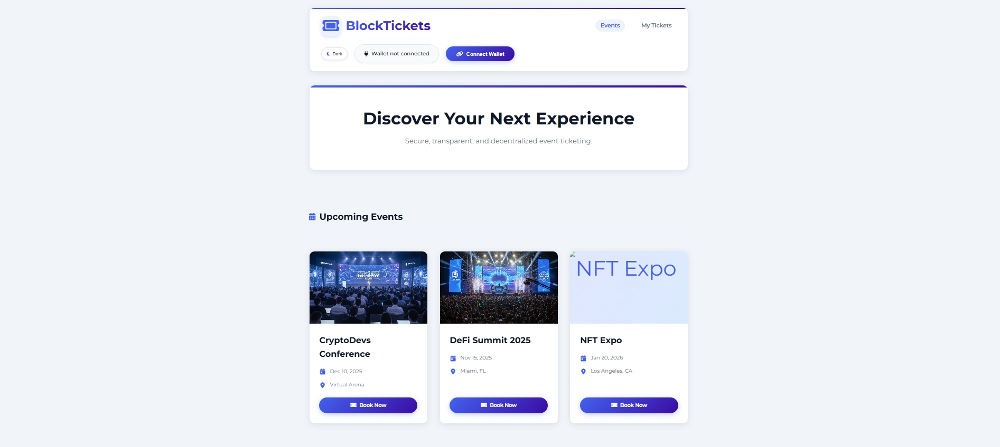
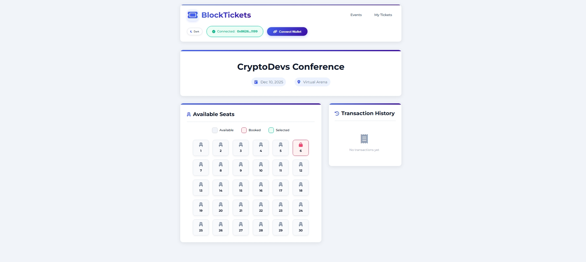

# 🎟️ BlockTickets - Blockchain Seat Booking dApp

[](https://opensource.org/licenses/MIT)
[](https://soliditylang.org/)
[](https://web3js.readthedocs.io/)

A decentralized seat booking application built on Ethereum blockchain that allows users to book event seats securely using smart contracts.

## 🌟 Features

- **Blockchain-Powered**: Secure seat bookings on the Ethereum blockchain
- **Wallet Integration**: MetaMask wallet connectivity for seamless transactions
- **QR Ticket Generation**: Instant QR code generation for booked seats
- **Email Delivery**: Send tickets directly to your email
- **Real-time Seat Status**: Live view of available and booked seats
- **Transaction History**: Complete record of all booking transactions
- **Responsive Design**: Works on all devices from mobile to desktop
- **Dark/Light Theme**: Toggle between color schemes based on preference

## 📸 Screenshots

### Dashboard

*Browse upcoming events and select the one you want to attend*

### Seat Selection

*Interactive seat map with real-time availability status*

### My Tickets

*View and manage all your booked tickets in one place*

## 🚀 Getting Started

### Prerequisites

- Node.js (v14 or higher)
- MetaMask wallet extension
- Ethereum testnet funds (Sepolia/Ethereum Testnet)

### Installation

1. Clone the repository:
```bash
git clone https://github.com/your-username/seatbooking.git
cd seatbooking
```

2. Install dependencies:
```bash
npm install
```

3. Start the development server:
```bash
node server.js
```

4. Visit `http://localhost:3000` in your browser

### Smart Contract Deployment

1. Compile the smart contracts:
```bash
npx hardhat compile
```

2. Start a local blockchain node:
```bash
npx hardhat node
```

3. In a new terminal, deploy the contract to the local network:
```bash
npx hardhat run scripts/deploy.js --network localhost
```

4. The contract will be deployed and its address will be printed to the console. Update this address in `frontend/js/shared.js` in the `contractAddress` variable.

## 🛠️ Technology Stack

- **Smart Contracts**: Solidity ^0.8.0
- **Frontend**: HTML5, CSS3, JavaScript ES6
- **Blockchain Framework**: Hardhat
- **Web3 Library**: Web3.js
- **Backend**: Node.js, Express
- **Email Service**: Nodemailer
- **UI Framework**: Custom CSS with modern design principles

## 📁 Project Structure

```
seatbooking/
├── contracts/
│   ├── SeatBooking.sol     # Main smart contract
│   └── Lock.sol           # Sample contract
├── frontend/
│   ├── css/
│   │   ├── style.css      # Main styles
│   │   └── theme.css      # Theme styles
│   ├── js/
│   │   ├── booking.js     # Booking page logic
│   │   ├── dashboard.js   # Dashboard logic
│   │   ├── mytickets.js   # My tickets logic
│   │   └── shared.js      # Shared utilities
│   ├── booking.html       # Seat booking page
│   ├── index.html         # Dashboard page
│   └── mytickets.html     # My tickets page
├── ignition/modules/
├── scripts/
├── test/
├── server.js              # Backend server
└── README.md
```

## 🧪 Testing

Run smart contract tests:
```bash
npx hardhat test
```

## 🤝 Contributing

1. Fork the repository
2. Create your feature branch (`git checkout -b feature/AmazingFeature`)
3. Commit your changes (`git commit -m 'Add some AmazingFeature'`)
4. Push to the branch (`git push origin feature/AmazingFeature`)
5. Open a pull request

## 📄 License

This project is licensed under the MIT License - see the [LICENSE](LICENSE) file for details.

## 🙏 Acknowledgments

- [Hardhat](https://hardhat.org/) - Ethereum development environment
- [Web3.js](https://web3js.readthedocs.io/) - Ethereum JavaScript API
- [MetaMask](https://metamask.io/) - Crypto wallet and gateway to blockchain apps
- [QRCode.js](https://davidshimjs.github.io/qrcodejs/) - QR code generator

## 📞 Support

If you have any questions or need help, please open an issue or contact the project maintainers.
